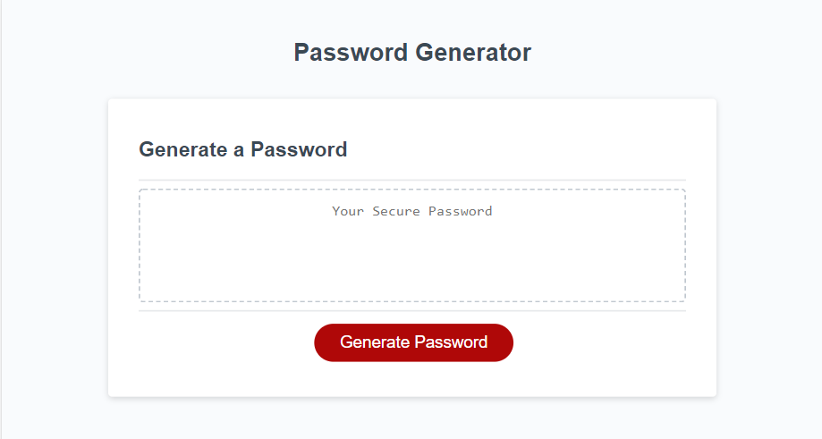
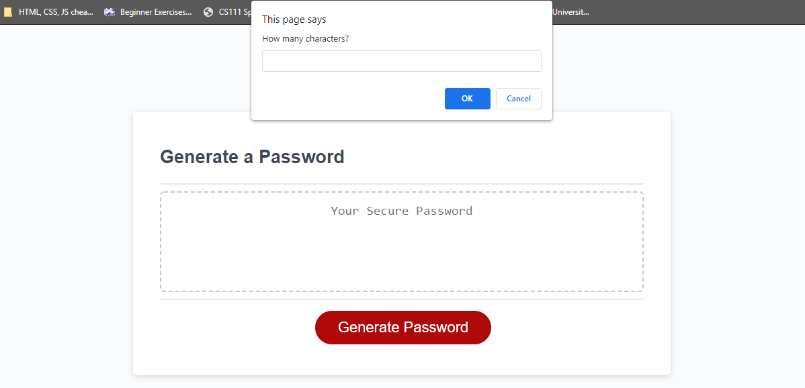
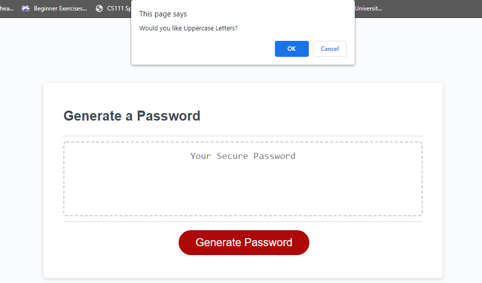
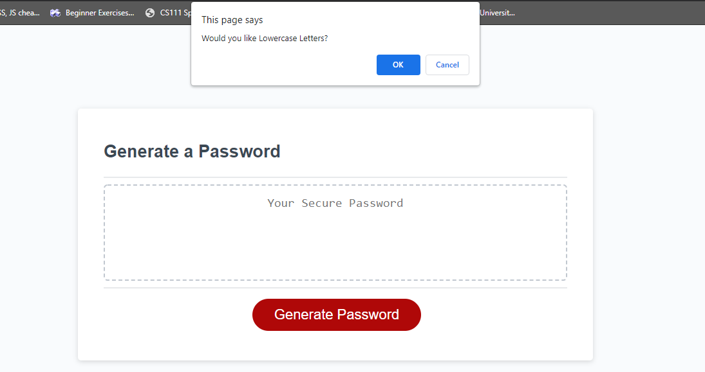
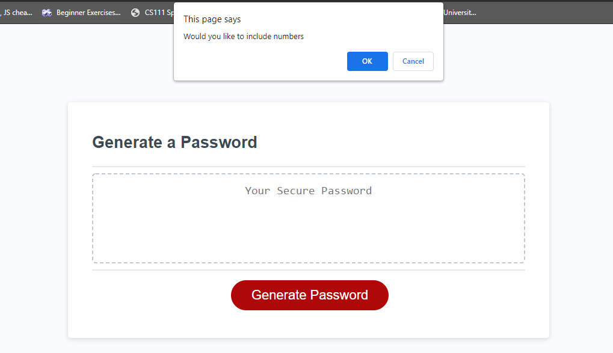
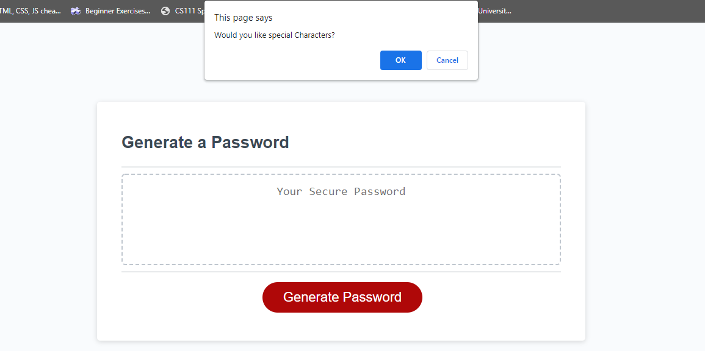
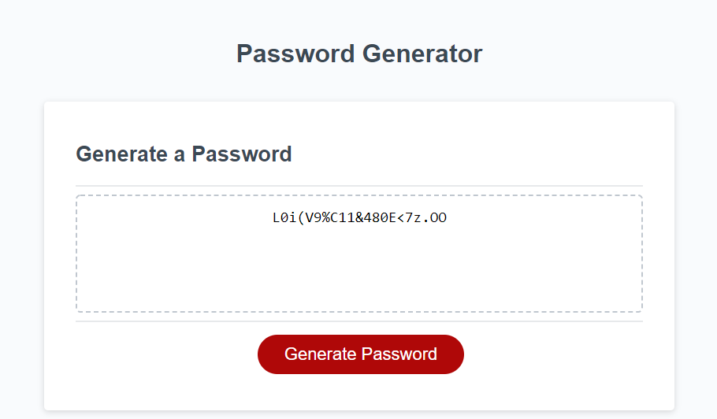

# **Password-Generator**

## An application that an employee can use to generate a random password based on criteria they’ve selected. This app will run in the browser.

<!--  -->

### GIVEN I need a new, secure password

### WHEN I click the button to generate a password

### THEN I am presented with a series of prompts for password criteria

- This starter code has the button event code already queued up.
- Once the button is clicked, `writePassword()` is called, which is where the password will be created and put on to the user screen.
- Inside `writePassword()`, `generatePassword()` is called and it will return the final password into a local variable inside of `writePassword()` called password.

### WHEN prompted for password criteria

### THEN I select which criteria to include in the password

- Using Javascript to prompt the user and take in data input from the user.
- Inside the `generatePassword()`function we will call the `setPasswordRequirements()` function in order to set the variables we have created by prompting the user

### WHEN prompted for the length of the password

### THEN I choose a length of at least 8 characters and no more than 128 characters

- Added validation to the first prompt for the password length
- Password must not be null or NaN(not a number)
- Password must be between 8 and 128 characters length

<!--  -->

### WHEN asked for character types to include in the password

### THEN I confirm whether or not to include lowercase, uppercase, numeric, and/or special characters

- `setPasswordRequirements()` function after getting the length will prompt the user to confirm uppercase, lowercase, numbers and special characters

<!--  -->

<!--  -->

<!--  -->

<!--  -->

### WHEN I answer each prompt

### THEN my input should be validated and at least one character type should be selected

- Validation is set to ensure that at least one option gets set.
- for each prompt, a value of true or false is set to each of the requirement variables in order to use our next functions.

### WHEN all prompts are answered

### THEN a password is generated that matches the selected criteria

- `randompassword()` function gets called after all the requirements are filled out and that function will take in 4 arguments which will be the requirements
- These requirements will be used to set up the array used to generate the password, any requirement that is true, the string will will be added to the array
- All the conditions will be accounted for and the a helper function will be used to actually get the random character and return it.

### WHEN the password is generated

### THEN the password is either displayed in an alert or written to the page

- The starter code included a function that will display the password in the html
- In order to display the password, inside of our `generatePassword()` function, after the for loop is done adding characters to the password string
- We must `return password;` to pass the value back to the `writePassword()` function which is how the password will be displayed

<!--  -->

# Dont believe me, test it out Yourself

- https://dorvilsteven.github.io/password-generator/
